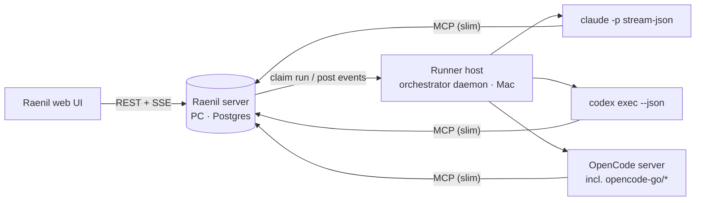

# Agents in Raenil (Paperclip-style connectors)

Status: **In Progress** — spec locked 2026-09-25; vertical slices. Tracked in .scratch only.

## Objective

Talk to coding agents from Raenil's web UI instead of the terminal. An agent is a
first-class thing you create, configure and test in the UI; it runs on this Mac
through Claude Code, Codex or OpenCode (incl. OpenCode Go models); it asks you
structured questions on the ticket and resumes when you answer; every run is
visible live, with tokens and cost.

Reference: Paperclip v2026.916.1 (MIT), studied 2026-09-24 — source read + live
walkthrough of its Agents / Harness / Runs / Costs / Connectors screens.

## What stays Raenil's (not copied)

- **Done is decided by a program.** Typed done-when criteria gate In Review / Done.
  Paperclip lets the agent's own claim close work by default; we do not.
- **The human reviews every diff.** Agents never move a ticket past In Review.
- **Record-keeping** (docs, link_commit, activity) stays as is.
- **Slim, compact MCP** (just shipped). Paperclip's onboarding chat showed 560k
  input tokens (likely incl. cache reads, which its parser counts as input); token
  cost is a design constraint here, not an afterthought.

## Architecture decision (confirmed 2026-09-25)

Raenil server runs on the PC; repos and agent CLIs live on this Mac. So:

- **Raenil server = control plane.** Agents, runs, interactions, costs, UI, SSE.
- **Orchestrator daemon on the Mac = executor ("runner host").** Registers itself,
  reports which harnesses are installed/logged in, claims queued runs, executes
  them in worktrees, streams run events back.
- **Connections follow Paperclip's subscription approach (user, 2026-09-25):**
  Claude Code and Codex run on **subscription logins, never API keys**. OpenCode Go
  is the only API-key connection. See "Connections" below.

## Connections (mirrors Paperclip; traced in its source 2026-09-25)

**Connect (once per account):**
- The runner host makes a 0700 login dir and the UI shows the command to paste
  in a terminal on the Mac (or runs it in a PTY):
  - Claude: `CLAUDE_CONFIG_DIR=<dir> claude setup-token` → a ~1-year OAuth token
    (`sk-ant-oat01-…`). Preferred over `claude auth login`, whose token is
    short-lived and Paperclip cannot refresh.
  - Codex: `CODEX_HOME=<dir> codex -c 'cli_auth_credentials_store="file"' login --device-auth`
    → `auth.json` {access, refresh, id token, account id}.
  - OpenCode Go: paste an API key (the only key-based connection).
- Verify before saving (Claude: `GET api.anthropic.com/api/oauth/usage`;
  Codex: ChatGPT usage endpoint), then delete the login dir. Login output never
  logged.

**Store:** encrypted at rest (AES-256-GCM, master key from env / 0600 key file,
never in the DB). A `connections` row per provider holds metadata only: account
email, method, status, last verified. Secrets live in a separate store.

**Use in a run (runner host):**
- Blank every provider auth env var (`ANTHROPIC_API_KEY`, `OPENAI_API_KEY`, …)
  so nothing is inherited.
- A temporary `HOME` / `CLAUDE_CONFIG_DIR` / `CODEX_HOME` per run, 0700,
  `rm -rf` afterwards.
- Claude: `CLAUDE_CODE_OAUTH_TOKEN=<token>`. Codex: write `auth.json` (0600) plus
  `config.toml` forcing file storage; after the run, if Codex refreshed the token,
  save the newer `auth.json` back (compare `last_refresh`, under a row lock).
- Refuse the run if the repo's `.claude/settings*.json` / `.codex/config.toml`
  carries `apiKeyHelper` or `*_API_KEY` (it would silently switch to key billing).
- Billing type from the run itself: Claude's init `apiKeySource: "none"` =
  subscription (more reliable than Paperclip's "is a key env var set?").

**Until the Connections slice lands** the runner uses the Mac's own CLI login;
`Available()` refuses a Claude login that is not a claude.ai subscription.

## Scope — five layers

### 1. Adapter parity (orchestrator, Go)
- `ClaudeRunner`: `claude -p --output-format stream-json --verbose`, `--resume`,
  `--model`, allowlist permissions (`--permission-mode acceptEdits` +
  `--allowedTools`; read-only for review; `--tools ""` for judge). **Caveat:**
  measured 2026-09-25 (claude 2.1.281, `-p`, `acceptEdits`):
  - **Must pass `--setting-sources project`**, or the run loads the user's
    personal `~/.claude` settings and hooks.
  - Writes **outside** the working dir are refused and reported in
    `permission_denials` (`touch /tmp/x` → denied).
  - Read-only commands (`uname`) and file commands inside the cwd (`touch`) are
    auto-approved even when not allowlisted.
  - Prompt must go on **stdin**: `--tools` / `--mcp-config` are variadic and
    swallow a trailing positional prompt.
  - Arbitrary interpreters (`python -c` writing elsewhere) not yet tested —
    test before calling this workspace-write parity.
  `--strict-mcp-config` with only Raenil's MCP, `--max-budget-usd` when set.
  Tokens = sum of `modelUsage` (top-level `usage` misses subagents). Denied tools
  from `permission_denials`.
- Common adapter surface for Claude / Codex / OpenCode: `Run`, `Ready` (test
  environment), `Models` (list), `Ask/AskIn`, stream parser → normalised run
  events, usage split into **input / cache-read / cache-creation / output**
  (one total misleads), with **billing type** (`subscription` | `api`) and
  `usageBasis` (per-run vs session-cumulative).
- Cost policy: subscription runs record tokens + notional $, never counted
  against `--max-cost-hour`; api runs count.

### 2. Agents as entities + UI
- `agents` table: name, role/title, harness (claude|codex|opencode), model,
  thinking effort, instructions (markdown), permission preset, max turns,
  env vars (names only / secrets out of scope), budget (monthly tokens or $),
  status (active | paused | error).
- **Connections page** (Paperclip's "Connectors", minus stored keys): per runner
  host, each harness — Claude Code, Codex, OpenCode (+ opencode-go models) —
  installed? logged in? models available? and how to fix when not.
- UI: Agents list; agent page with sections modelled on Paperclip —
  Overview, Instructions, Harness/Runtime (+ **Test environment** button → runner
  host runs `Ready`), Runs, Costs/Budget.
- Tickets get an **assignee agent**; the `runner` label becomes a fallback.

### 3. Sessions + skills
- `agent_sessions` keyed (agent, harness, ticket): session id + a fingerprint of
  cwd, instructions hash and MCP config. Resume only when the fingerprint matches;
  otherwise start fresh.
- Rotation: after N runs / N input tokens / N hours, start a fresh session seeded
  with a handoff summary document.
- Instructions/skills bundle materialised per run (Claude:
  `--append-system-prompt-file` on fresh sessions only; others: prompt prefix).

### 4. Runs + run viewer
- `runs` table: agent, ticket, harness, model, status, started/ended, session,
  tokens in/out, cost, billing type, exit/abort, denied tools, log path.
- `run_events`: normalised stream (assistant text, tool call, tool result, usage),
  capped, truncated **and redacted** (env values, tokens) before leaving the Mac,
  posted by the runner host.
- UI: live transcript via SSE, run header (status, model, tokens, duration,
  session), tasks touched, stderr tail; Costs page by agent / by ticket with the
  subscription vs api split.

### 5. Interactions (ask in the UI, not the terminal)
- MCP tool `ask_user {issue, questions:[{text, options[], multi, allowOther}]}`:
  posts a question card on the ticket and ends the run in `waiting`.
- UI: question card on the ticket (paged "2 of 4", options + Other), inbox
  badge / "Agent is asking a question" toast via SSE.
- Answering wakes the agent: a new run, same session, with the answers.
- Plan approval: `request_approval {issue, document}` bound to the document
  revision hash; editing the document expires the approval (Paperclip's
  revision binding, done eagerly rather than lazily).

### 6. Routines + timers (in scope, after the slice)
- Routines: cron / webhook / manual trigger → creates a ticket assigned to an
  agent. Due triggers claimed with a compare-and-swap on `next_run_at`; at most
  one open ticket per routine (new fires coalesce into it); catch-up capped.
- Agent heartbeat on interval (off by default): wakes the agent to check its
  assigned tickets / questions answered.

## Out of scope (for this epic)

Org charts / reporting lines / agents hiring agents (user: out), the third-party
MCP connector catalog (user: out), multi-company, cloud sandboxes.

## Slice 1 — Claude runner: done when
- [x] `ClaudeRunner` implements Runner, Asker, Ready, EffectiveModel (`internal/orchestrator/claude.go`).
- [x] Prompt on stdin; `--setting-sources project`; `--strict-mcp-config`; user settings not loaded.
- [ ] **No user hooks at all.** One SessionStart hook still fires (outputs `{}`). `--bare` would skip it but reads only `ANTHROPIC_API_KEY`, never the subscription, and skips CLAUDE.md. Full isolation = temp `CLAUDE_CONFIG_DIR` + `CLAUDE_CODE_OAUTH_TOKEN` from `setup-token` → lands with the Connections slice.
- [x] Work runs: writes inside the worktree allowed; writes outside by `touch`, shell redirect and `python3 -c` all refused and reported in `DeniedTools` (live test, 2026-09-25).
- [x] Bare `Bash` never pre-approved; extra rules via `CLAUDE_ALLOWED_TOOLS` (machine-wide for now — per-repo/per-agent comes with the agents entity). Without rules a worker cannot run `go test`; criteria still run the checks themselves.
- [x] API-key env vars (`ANTHROPIC_API_KEY`, Bedrock/Vertex switches, `OPENAI_API_KEY`, …) stripped from Claude and Codex child processes; Codex must be a ChatGPT login.
- [x] Reviewer (AskIn) read-only; judge (Ask) no tools.
- [x] Tokens from `modelUsage` split input / cache-read / cache-creation / output; subscription cost recorded as notional, not billed.
- [x] Refuses a non-subscription (API-key) login.
- [x] `claude` in runner pool, `--runner`/`--asker`, runner label (migration 0018 + new-workspace seed).
- [x] Unit tests on real (scrubbed) fixtures + fake binary; live test passes on the subscription.

## Decisions 2026-09-25 (round 2)

- **Run everything from the web dashboard**, Paperclip-style. Only two terminal
  touches, same as Paperclip: connecting a subscription (paste a login command
  once) and the runner-host daemon on the Mac (launchd service).
- **Copy Paperclip's UI too**: sidebar, Dashboard, Tasks, New Task composer,
  conversation-style task page, Agents, Connectors, Audit. Re-implemented in
  Svelte (Paperclip is React); MIT notice kept in `THIRD_PARTY_NOTICES.md`.
- **Tasks view:** Paperclip-style list by default, Kanban board one toggle away.
- **Aligning is agent-led but keeps our workflow:** discuss a task with an agent
  in its thread → the agent helps split it into tickets with typed done-when →
  you approve → Ready. **You** decide when an agent runs a ticket (a Run button);
  nothing auto-starts.
- **Vertical slices:** each ships its backend with its Paperclip-style screen.

## Slices (vertical, in order)

| # | Slice | Backend | Screen |
|---|---|---|---|
| 1 | Claude runner | ClaudeRunner, key stripping | — (done) |
| 2 | Runs | `runs` table + API + SSE; orchestrator records every attempt (redacted log tail) | Run blocks in the task page; run detail page |
| 3 | App shell + Tasks | recent tasks, search | Paperclip sidebar; Tasks list (by day) + Board toggle; New Task composer "For [agent] in [project]" |
| 4 | Dashboard | stats endpoint (KPIs, 14-day series) | Agents strip, 4 KPI cards, run activity / tasks by status / success rate, recent activity, recent tasks |
| 5 | Agents + Connections | `agents` table/API; runner host registers + reports harness health | Agents list; agent page (Overview, Instructions, Harness/Runtime + Test environment, Runs, Costs); Connectors page |
| 6 | Run from the UI | queued runs; runner-host daemon claims + executes via orchestrator | "Run" on a ticket with an agent; live status |
| 7 | Conversation + questions | `ask_user` MCP tool; answer → resume same session | Task page as a thread; question cards ("2 of 4"); inbox toast |
| 8 | Agent-led Aligning | chat turn on a task; proposal = child tickets + done-when | Approval card: approve → tickets created in Ready |
| 9 | Live transcript + Audit | `run_events` streamed | Live transcript; Audit: Activity, Runs, Costs (subscription vs api), Budgets |
| 10 | Sessions + instructions | session store, fingerprinted resume, rotation handoff; per-agent instructions | Instructions tab |
| 11 | Subscription connections | `setup-token` / device-auth, encrypted store, isolated config dir per run | Connect flow on Connectors (fixes hook isolation) |
| 12 | Routines + timers | routines, CAS scheduler, heartbeat-on-interval | Routines page |

## Slices 7–8 design (2026-09-25)

- **Chat turns.** "Ask {agent}" on a ticket queues a `chat` job. The host runs the
  agent read-only in the ticket's repo, with Raenil's MCP (agent id in an
  `X-Raenil-Agent` header), and posts its final answer as a comment from that
  agent. The session per (agent, ticket) is kept, so the next turn resumes it
  (same cwd: the repo root). Chat runs are recorded as runs of kind `chat`.
- **Questions.** MCP `ask_user {issue, questions}` creates an interaction; the
  ticket shows a question card ("2 of 4", options + Other). Answering it queues
  the next chat turn with the answers — Paperclip's "answer wakes the agent".
- **Proposals (slice 8).** MCP `propose_tickets {issue, tickets:[{title,
  description, criteria}]}` creates an approval card; approve → child tickets
  created with their typed done-when, in Ready. Running them stays a Run click.
- Interactive MCP tools are Claude-only for now; Codex/OpenCode chat replies in text.
- A worker (work run) that needs an answer uses the same `ask_user`; its run ends
  and the ticket waits for the answer before the next Run.

## Done when (epic)

- [ ] An agent can be created, configured and environment-tested entirely from the web UI, for each of Claude, Codex and OpenCode (incl. an opencode-go model).
- [ ] Assigning a Ready ticket to an agent runs it on the Mac runner host without touching the terminal.
- [ ] The run is visible live in the UI with model, tokens, duration and a transcript; cost shows subscription vs api.
- [ ] An agent question appears as a card on the ticket; answering it resumes the same session.
- [ ] Typed done-when criteria still gate In Review; no agent can move a ticket past In Review.
- [ ] Each child ticket's own done-when is met.
