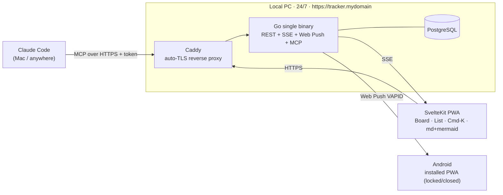
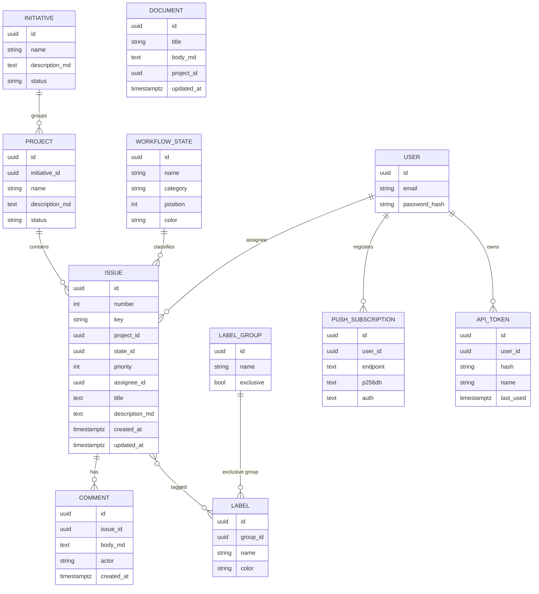
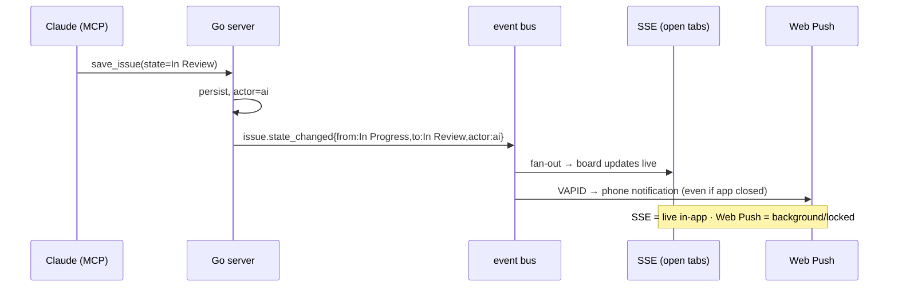

# Kanri — self-hosted, AI-driven issue tracker (Linear replacement)

> Working codename **Kanri** (管理, "management"). Rename is a find/replace.
> Status: **BUILT** (v1 implemented + verified this session). Decisions locked:
> MCP mirrors Linear verbs · remote HTTP/SSE MCP on the Go server · argon2id
> password + session cookie · Initiatives → Projects → Issues. Defaults taken
> for the §11 open questions: env-driven domain (`KANRI_BASE_URL`), docker-compose,
> start clean, kept the name Kanri.

## 1. Objective

A single-user, self-hosted project tracker that replaces paid Linear, matches my
continuous-flow Kanban workflow exactly, and is drivable by Claude Code over MCP —
so Claude creates/moves issues the same way it does with Linear today, but with **no
per-seat cost and no plan limits**.

Runs 24/7 on my Local PC (has a domain + 1000/500 Mbps + is internet-reachable).
Installable as a PWA on Android and usable on desktop. Live updates via SSE;
background push notifications when a status changes — including when **AI** moves it.

## 2. Scope

### In
- Workflow states: `Triage → Backlog → Aligning → Ready → In Progress → In Review → Done → Canceled`.
  (Triage is the optional inbox column; the states I use daily are Backlog…Done + Canceled.)
- Hierarchy: **Initiatives → Projects (epics) → Issues**. Comments on issues.
- **Documents**: standalone markdown docs (like my `feature-catalog.md`), markdown stored raw.
- **Mermaid**: ```mermaid fences render to SVG in-app, with a code/preview toggle. Honors my
  "backend tickets carry a mermaid diagram" convention (the require-mermaid hook keeps working).
- Labels in **exclusive groups**: `repo`, `platform`, `type`, `domain`, `triage` (one per group).
- Priority, assignee (just me), due/created/updated timestamps, issue key `K-<n>`.
- Views: **Board** (kanban by state), **List**, issue detail panel, **Cmd-K** command palette,
  keyboard shortcuts. Linear-like feel, mobile + desktop responsive.
- **Realtime**: SSE live board/issue updates while a tab is open.
- **Push**: Web Push (VAPID) background notifications to installed Android PWA on state change,
  tagged with actor `human | ai`.
- **Auth**: argon2id password login + httpOnly secure session cookie; API token(s) for MCP.
- **MCP**: remote HTTP/SSE endpoint on the Go server, tool surface mirroring Linear's verbs.

### Out (v1 non-goals)
- Multi-user / teams / permissions (single workspace, single user — me).
- Milestones inside projects (deferred; hierarchy stops at Project→Issue for now).
- Cycles, estimates, story points, sprints (explicitly rejected — continuous-flow only).
- Git/PR integration, SLA, time tracking, third-party integrations.
- Offline write / full CRDT sync (offline *read* of cached board is a maybe-later).

## 3. Architecture



Single Go binary, subcommands like nani/globex:
- `kanri serve` — REST API + SSE + Web Push + MCP endpoint (all one process).
- `kanri migrate` — run DB migrations.
- `kanri mcp` — (optional) stdio MCP fallback for local use; primary MCP is the remote endpoint.

## 4. Data model



- `WORKFLOW_STATE.category ∈ {triage, backlog, unstarted, started, completed, canceled}` (drives
  board grouping + which category "counts as done"). Aligning + Ready = `unstarted`; In Review = `started`.
- Issue key: global counter → `K-1, K-2, …`. Prefix configurable.
- Seed migration inserts the 8 states + the 5 exclusive label groups.

## 5. MCP surface (mirror Linear verbs)

Server registered in Claude Code as `tracker` → tools appear as `mcp__tracker__<verb>`.
Same shapes as Linear so my CLAUDE.md workflow + memories port; the `require-mermaid.py`
hook matcher changes `mcp__plugin_linear_linear__save_issue` → `mcp__tracker__save_issue`.

| Tool | Purpose |
| --- | --- |
| `list_issues`, `get_issue`, `save_issue` | list/read/upsert issue (title, description_md, state, labels, project, priority, assignee) |
| `list_projects`, `get_project`, `save_project` | projects (epics), optional `initiative` |
| `list_initiatives`, `save_initiative` | top-level grouping |
| `list_issue_statuses`, `get_issue_status` | the 8 workflow states |
| `list_issue_labels`, `create_issue_label` | labels + exclusive groups |
| `list_comments`, `save_comment` | issue comments |
| `list_documents`, `get_document`, `save_document` | markdown docs |
| `get_user` | returns me (single user) |

- Transport: **remote HTTP/SSE** (MCP Streamable HTTP) served at `/mcp`, `Authorization: Bearer <API_TOKEN>`.
- `save_issue` moving `state` is what triggers the notification event with `actor = ai`.

## 6. Realtime + notifications

One domain event, two consumers. On any issue mutation the server emits
`issue.state_changed` (also `issue.created`, `comment.added`) carrying `{issue, from, to, actor}`.



- **SSE** `/events` (per-user stream, resumable via Last-Event-ID). Handles the live board.
- **Web Push**: PWA service worker subscribes (VAPID keypair), server stores subscription,
  pushes on events. This is the *only* path that reaches a locked phone — SSE cannot.
- Notification body: `"K-42 → In Review (moved by AI)"`, deep-links to the issue.

## 7. Auth

- Bootstrap: `kanri serve` with no user → one-time setup page to create my account (argon2id hash).
- Login → httpOnly + Secure + SameSite session cookie; CSRF token for mutations.
- Rate-limit login. Optional TOTP / passkey later (chose password+session for v1).
- **MCP / API tokens**: separate hashed bearer tokens (`kanri token create`), shown once.

## 8. Tech choices (proposed, confirm in build)

- **Backend**: Go 1.25, stdlib `net/http` mux, `pgx` v5 + `sqlc`, `goose` migrations,
  `webpush-go` (VAPID), argon2 via `golang.org/x/crypto`, MCP via official Go SDK (`modelcontextprotocol/go-sdk`).
- **Frontend**: SvelteKit + Svelte 5 runes, `vite-plugin-pwa`, `markdown-it` + `mermaid`,
  `svelte-dnd-action` for board drag, custom Cmd-K palette.
- **Infra**: docker-compose on Local PC (postgres + kanri + caddy). Caddy does auto-TLS for the domain.
- **Backups**: nightly `pg_dump` to disk (+ optional offsite).

## 9. Build breakdown (Initiative → Projects → Ready issues)

**Initiative: "Kanri v1 — self-hosted tracker"**

1. **Project: Core API + data model** — schema/migrations, states+labels seed, issue/project/initiative CRUD, auth, API tokens.
2. **Project: MCP server** — Linear-verb tool surface over remote HTTP/SSE, token auth, mermaid-gate compatibility.
3. **Project: Realtime + notifications** — event bus, SSE endpoint, Web Push (VAPID) + service worker.
4. **Project: Web app (SvelteKit PWA)** — board + list + issue panel + Cmd-K, md+mermaid render, PWA install, responsive.
5. **Project: Deploy + ops** — docker-compose, Caddy TLS, backups, bootstrap flow, migrate from Linear.

## 10. Done-when (v1 acceptance)

- [ ] I install the PWA on Android from my domain; login works.
- [ ] Board shows my 8 states; I drag an issue → state persists + other open tab updates live (SSE).
- [ ] Claude Code, via `mcp__tracker__save_issue`, creates an issue and moves it to In Review.
- [ ] That AI move fires a Web Push notification to my phone while the app is closed.
- [ ] An issue description with a ```mermaid fence renders as a diagram in-app.
- [ ] A backend-labeled `save_issue` with no mermaid is blocked by the existing hook (prefix swapped).
- [ ] Initiatives group Projects group Issues; a standalone markdown Document renders.
- [ ] Runs 24/7 behind Caddy TLS on the Local PC; nightly pg_dump exists.

## 11. Open questions

- Exact domain/subdomain for the tracker? (affects Caddy config + VAPID origin)
- Local PC OS (for docker-compose vs native systemd)?
- Migrate existing Linear issues (PP/ACM) in, or start clean and dual-run during transition?
- Keep the codename **Kanri** or rename?
