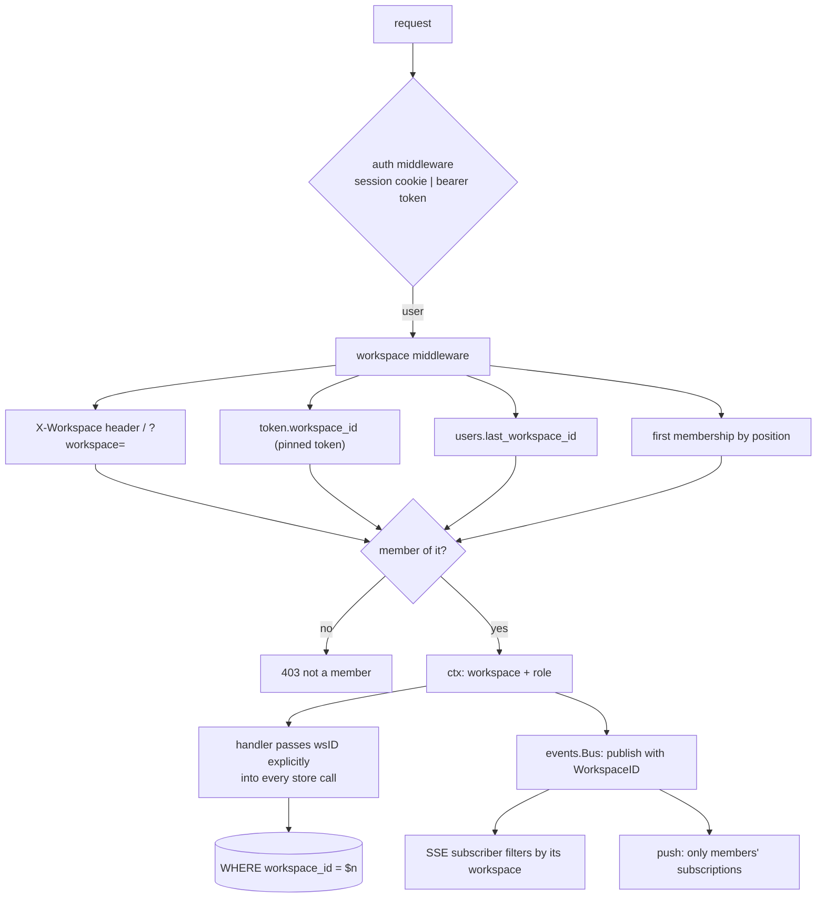

# Workspaces — multi-tenancy for Raenil

Status: **Aligning → Ready**
Date: 2026-07-30

## Objective

Partition Raenil so a signed-in user sees exactly one workspace at a time, and so a
second person can be given access to one workspace without seeing the others. Today
every row in the database is global: one `issue_number_seq`, globally-unique label and
workflow-state names, no tenant column anywhere, and every query returns everything.

## Locked decisions

| # | Decision | Consequence |
|---|---|---|
| D1 | Workspace is a **new top level**: `Workspace → Project(initiative) → Epic(project) → Issue` | New `workspaces` table; `workspace_id` denormalized onto every root table |
| D2 | Backfill **one workspace per existing initiative** — Platform, Acme Engineering, Globex | Their prefixes: `PER`, `ACM`, `GLX`. Orphan rows get an `Unsorted` workspace, created only if orphans exist |
| D3 | Issue keys become **per-workspace, for new issues only** | Existing `R-N` keys are never rewritten. New issues in Acme get `ACM-1`, etc. |
| D4 | **Labels, workflow states, documents, activity + inbox are all per-workspace** | Every workspace gets its own copy of the 8 states and of the label/label-group set |
| D5 | **Real membership** — `workspace_members(workspace_id, user_id, role)` | Every query filters by membership. Raenil becomes genuinely multi-tenant |

## Non-goals (v1)

- Email invitations / signup flow. Users are still created by `raenil user <email> <pass>`;
  an owner then adds an existing user to a workspace by email.
- Moving an issue between workspaces (the epic/initiative move is enough to start).
- Per-workspace VAPID keys or branding.
- Cross-workspace search or a "everything I can see" view. One workspace at a time.

## Schema

```sql
CREATE TABLE workspaces (
    id         uuid PRIMARY KEY DEFAULT gen_random_uuid(),
    slug       text NOT NULL UNIQUE,          -- url-safe, e.g. 'acme-engineering'
    name       text NOT NULL,
    key_prefix text NOT NULL UNIQUE,          -- e.g. 'ACM' — prefix for NEW issue keys
    issue_seq  bigint NOT NULL DEFAULT 0,     -- per-workspace issue counter
    position   int  NOT NULL DEFAULT 0,
    created_at timestamptz NOT NULL DEFAULT now(),
    updated_at timestamptz NOT NULL DEFAULT now()
);

CREATE TABLE workspace_members (
    workspace_id uuid NOT NULL REFERENCES workspaces(id) ON DELETE CASCADE,
    user_id      uuid NOT NULL REFERENCES users(id) ON DELETE CASCADE,
    role         text NOT NULL DEFAULT 'member',   -- owner | admin | member
    created_at   timestamptz NOT NULL DEFAULT now(),
    PRIMARY KEY (workspace_id, user_id)
);
CREATE INDEX workspace_members_user_idx ON workspace_members(user_id);
```

`workspace_id uuid NOT NULL REFERENCES workspaces(id) ON DELETE CASCADE` is added to:
`initiatives`, `projects`, `issues`, `documents`, `labels`, `label_groups`,
`workflow_states`, `activity`.

Child tables (`issue_labels`, `document_labels`, `comments`, `issue_criteria`,
`issue_commits`) are **not** given a column — they are only ever reached through an
already-scoped issue or document, and cascade from it.

`issues.workspace_id` must be denormalized rather than derived: an issue may have
`project_id IS NULL`, so there is no join path to walk up.

### Constraint changes

| Table | Before | After |
|---|---|---|
| `workflow_states` | `UNIQUE (name)` | `UNIQUE (workspace_id, name)` |
| `labels` | `UNIQUE (name)` | `UNIQUE (workspace_id, name)` |
| `label_groups` | `UNIQUE (name)` | `UNIQUE (workspace_id, name)` |
| `issues` | `UNIQUE (number)` | `UNIQUE (workspace_id, number)` — per-workspace sequences collide by design |
| `issues` | `UNIQUE (key)` | **unchanged, stays globally unique** |

Keeping `issues.key` globally unique is deliberate: `GetIssueByKey`, `parent_key`,
`issue_by_commit` and every MCP call that passes `R-8` stay unambiguous with no
workspace argument. It holds because `workspaces.key_prefix` is itself UNIQUE.

### Issue key allocation

```sql
UPDATE workspaces SET issue_seq = issue_seq + 1 WHERE id = $1 RETURNING issue_seq, key_prefix
```
inside the create-issue transaction — the row lock serializes concurrent creates.
On a `issues_key_key` unique violation, bump and retry (bounded to 5 attempts) so that
a collision with a legacy key can never fail a create. Additionally, `key_prefix` may
not equal `RAENIL_ISSUE_PREFIX` (`R`), which is reserved for the pre-migration keys.

## Migration `0011_workspaces.sql` — order matters

1. Create `workspaces` + `workspace_members`.
2. Insert one workspace per existing initiative. `slug` = slugified name,
   `key_prefix` = first 3 alphanumerics of the name upper-cased, deduped with a digit
   (`Platform`→`PER`, `Acme Engineering`→`ACM`, `Globex`→`GLX`).
3. Add every user to every workspace with role `owner` (single-user box today —
   nobody loses access at the migration boundary).
4. Add `workspace_id` columns **nullable**.
5. Backfill top-down: `initiatives` ← its own workspace; `projects` ← its initiative's;
   `issues` ← its epic's; `documents` ← its issue/epic/initiative attachment;
   `activity` ← its issue's.
6. Create the `Unsorted` workspace **only if** any row is still NULL (orphan epics such
   as `Test Epic`, project-less issues, unattached documents, activity whose issue was
   deleted); assign the stragglers to it.
7. Clone `workflow_states` per workspace, then repoint `issues.state_id` to the clone
   matching `(issue.workspace_id, old.name)`; delete the legacy rows.
8. Clone `label_groups` + `labels` per workspace, repoint `issue_labels` and
   `document_labels` to the clone matching `(owner.workspace_id, old.name)`;
   delete the legacy rows.
9. Set every `workspace_id` `NOT NULL`; swap the unique constraints; drop
   `issue_number_seq` (superseded by `workspaces.issue_seq`).

Step 7 and 8 are the risky ones — they rewrite FKs on every issue and every label link.
The migration is a single transaction; a failure rolls the whole thing back.

## Request scoping — the enforcement seam



Resolution order: explicit `X-Workspace` header (slug or id) → token pin →
`users.last_workspace_id` → first membership. A pinned token that is asked for a
different workspace gets 403, never a silent fallback.

**The workspace id is passed as an explicit argument to every store method** — not read
from a context inside the store. An unscoped read then fails to compile instead of
leaking silently. Concretely: `WorkspaceID` becomes a field on `IssueFilter` and a
leading parameter on `GetIssue`, `UpdateIssue`, `DeleteIssue`, `GetIssueByKey`,
`GetProject`, `GetState`, `ListLabels`, `RecordActivity`, `ListDocuments`, … .

`events.Event` gains `WorkspaceID`; `Bus.Subscribe(wsID)` only receives matching events.
Without this, workspace A's board live-updates from workspace B's activity.

`ListPushSubscriptions` gains a workspace filter — a notification for a Acme issue must
not reach a device whose owner is only a member of Globex.

## MCP

- `api_tokens.workspace_id uuid NULL` — NULL means "any workspace this user belongs to".
  `raenil token <name> [--workspace <slug>]` pins it. This is what lets Claude working in
  the Globex repo see only Globex.
- Every tool gains an optional `workspace` argument (slug); it is required only when the
  token is unpinned and the user belongs to more than one.
- New tools: `list_workspaces`, `save_workspace`.
- The MCP server instructions string is updated to describe the 4-level hierarchy.

## Frontend

- `activeWorkspace` store, persisted to `localStorage`; `api.js` sends it as `X-Workspace`
  on every request.
- Workspace switcher at the top of `Sidebar.svelte`, above the brand — name + prefix, with
  a create action.
- Switching workspace re-runs `loadMeta()` + `loadIssues()` and clears
  `activeInitiative` / `activeProject` / `activeLabel`.
- `/settings/workspaces`: list, create, rename, set prefix, manage members (add existing
  user by email + role, remove, change role). Owner-only actions hidden for `member`.
- A 403 from the workspace middleware forces a switcher re-pick rather than a logout.

## Rollout — production has live data

Prod is `tracker.example.com` (Docker Compose, Postgres volume `./data/pg`).

1. `make backup` on the box → verify the `.sql.gz` is non-empty and restores.
2. Restore that dump into a scratch local Postgres and run `raenil migrate` against **it**
   first. Compare row counts before/after for issues, labels, issue_labels, documents,
   activity — they must be identical, only FKs repointed.
3. Only then deploy + migrate prod.
4. Verify the three workspaces exist with the expected issue counts, that every legacy
   `R-N` key still resolves, and that a newly created issue gets the workspace prefix.

## Done-when (epic level)

- Three workspaces exist post-migration, matching the three initiatives, with zero rows
  lost and no legacy issue key rewritten.
- With workspace Acme active, the board, list, inbox, activity log, artifacts, search and
  label filter show only Acme data.
- A second user added to only one workspace cannot read another workspace's issues via
  the REST API, the MCP endpoint, or the SSE stream.
- A workspace-pinned MCP token returns only that workspace's issues.
- A new issue created in Acme gets key `ACM-<n>`; `R-8` still resolves.

## Ticket breakdown

| # | Ticket | Depends on |
|---|---|---|
| W1 | Schema + backfill migration `0011_workspaces.sql` | — |
| W2 | Per-workspace issue keys (prefix + counter + collision retry) | W1 |
| W3 | Server-side scoping: store args, workspace middleware, membership 403s | W1 |
| W4 | Scoped realtime: per-workspace SSE fan-out + push targeting | W3 |
| W5 | MCP workspace awareness: token pinning, `workspace` arg, new tools | W3 |
| W6 | Frontend: workspace switcher + scoped loads | W3 |
| W7 | Workspace admin: settings UI, members, CLI commands | W3 |
