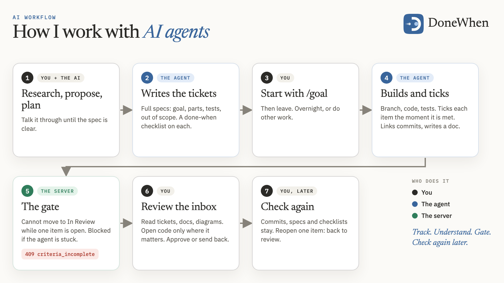
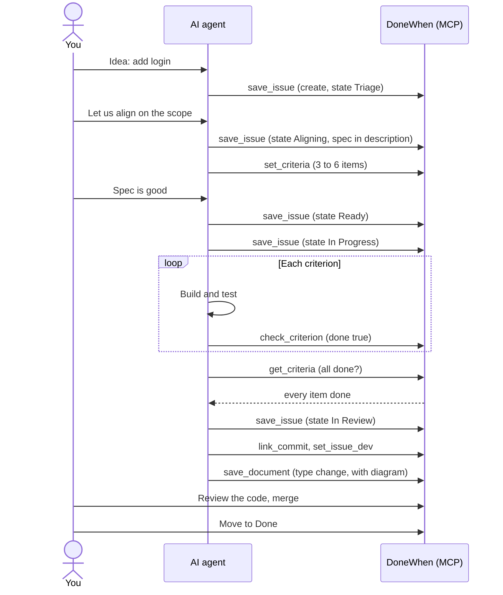

# AI workflow

This page shows how an AI agent drives a ticket in DoneWhen. For the ideas behind the workflow, read [CONCEPTS.md](CONCEPTS.md).



## The loop for one ticket

1. **Capture.** Put a one-line ticket in Triage.
2. **Align.** You and the AI talk. The AI writes the spec into the ticket and sets the done-when checklist (3 to 6 items). The ticket moves to Aligning. When the spec is locked, it moves to Ready.
3. **Build.** The ticket moves to In Progress. The AI works on a branch.
4. **Tick as you go.** The AI ticks an item the moment it is met. It does not wait for the end. If the session stops, the real progress is already saved.
5. **Review.** All items are done. The AI moves the ticket to In Review. You read the code. If you ask for changes, the ticket goes back to In Progress.
6. **Finish.** The AI saves the commit link, the branch and an engineering document. You merge. The ticket moves to Done.

If the AI cannot finish without you, it moves the ticket to **Blocked** and writes the reason in a comment.

## How an agent connects

The server has an MCP endpoint at `<your-server>/mcp`. It uses Streamable HTTP and a bearer token (`internal/mcp/mcp.go`). `donewhen mcp` runs the same tools over stdio as a local fallback.

1. Make a token: `donewhen token <name> [workspace]`. To pin the token to a workspace, give the workspace. The server shows the token one time.
2. Register the server in Claude Code:

```bash
claude mcp add --transport http donewhen \
  https://tracker.example.com/mcp \
  --header "Authorization: Bearer <token>"
```

The tool prefix comes from the name that you use to register the server. With the name `donewhen`, the tools are `mcp__donewhen__*`. If you use another name, the prefix changes to that name.

DoneWhen records every call that uses a token with the actor `ai`. It records your own browser actions as `human`.

## The tools, by job

All tools are in `internal/mcp/`. Each tool accepts an optional `workspace` argument. Most calls do not need it. A read spans every workspace that the token can reach. A write finds the workspace from the issue or epic that it names.

| Job | Tools |
|---|---|
| Find and read issues | `list_issues`, `get_issue`, `issue_by_commit` |
| Create, update, move, delete | `save_issue`, `delete_issue` |
| Epics (`project`) and projects (`initiative`) | `list_projects`, `get_project`, `save_project`, `archive_project`, `list_initiatives`, `get_initiative`, `save_initiative` |
| Comments | `list_comments`, `save_comment` |
| States and labels | `list_issue_statuses`, `get_issue_status`, `list_issue_labels`, `create_issue_label` |
| Done-when | `get_criteria`, `set_criteria`, `check_criterion` |
| Record | `link_commit`, `set_issue_dev`, `save_document`, `list_documents`, `get_document`, `get_activity`, `list_issues_missing_docs` |
| Workspaces and people | `list_workspaces`, `save_workspace`, `get_user` |

These are example calls, one for each job. The arguments are in JSON.

```text
list_issues     {"state": "Ready", "query": "login"}
get_issue       {"id": "ACM-42"}
save_issue      {"id": "ACM-42", "state": "In Progress"}
save_project    {"name": "Billing", "initiative": "<initiative id>"}
save_comment    {"issueId": "ACM-42", "body": "Blocked: need the API key from you."}
list_issue_statuses {}
set_criteria    {"issue": "ACM-42", "items": [{"text": "POST /login returns 200 with a valid password", "done": false}]}
check_criterion {"issue": "ACM-42", "index": 1, "done": true, "evidence": "go test ./internal/auth passes"}
link_commit     {"issue": "ACM-42", "sha": "952917c", "url": "https://github.com/acme/app/commit/952917c"}
set_issue_dev   {"issue": "ACM-42", "gitBranch": "feat/login", "prUrl": "https://github.com/acme/app/pull/7"}
save_document   {"issue": "ACM-42", "type": "change", "title": "Login", "body": "# Login ..."}
list_workspaces {}
```

The argument names above are the same as the names in the tool definitions in `internal/mcp/`.

## The finishing ritual

Do these steps in order. The record is true only if the checklist is true.

1. **Tick every criterion.** `get_criteria` shows each item with `done`. Every item must be `done: true`.
2. **Move the state.** Use `save_issue` with `state: "In Review"`. After you merge, use `Done`.
3. **`link_commit`** for each commit that did the work. Get the SHA from `git rev-parse HEAD`.
4. **`set_issue_dev`** with the branch and the pull request URL.
5. **`save_document`** with type `change`. The document says what changed and how, with a Mermaid diagram. Attach it to the issue.

`list_issues_missing_docs` lists the Done issues that have no document.

## The done-when gate

The rule: **a ticket does not move to In Review or Done while a criterion is open.**

Two layers keep the gate:

- The skill tells the agent to run `get_criteria` first. If an item is open, the agent must stop (`skills/donewhen/SKILL.md`).
- The server enforces the rule. `save_issue` with `state: "In Review"` or `"Done"` fails when an item is open. The error is `criteria_incomplete` and it lists the open items. If the ticket has no criteria, the error is `criteria_missing`.
- The check runs in the same database transaction as the state change. An agent cannot skip it.
- An owner or admin can force the move from the web app. The server records the override. An agent cannot force it.

You always review before Done.

If an item cannot be met, the agent asks you. The agent does not tick the item. The agent does not delete the item without a notice.

### Criterion kinds

A criterion has a `kind`: `manual`, `deterministic`, `policy` or `judgment` (`internal/models/models.go`). Today the server stores the kinds. The agent or you tick an item, with an optional `evidence` reference. The server does not run checks.

## The Claude Code plugin and skill

Both are optional. DoneWhen works with any MCP client.

**Skill** (`skills/donewhen/`). It teaches Claude how to use the tools correctly:

- `SKILL.md` has the model, the tool table, the spec-to-tickets steps, the checklist rules and the finishing ritual.
- `TICKETS.md` is the ticket-writing standard: Goal, numbered parts, notes, acceptance tests, out of scope.
- `MERMAID.md` has the rules for diagrams, so that they do not show as red error boxes.

**Plugin** (`plugin/`). It adds one command, `/donewhen:tasks`:

- With no arguments, the command is interactive. It asks for a workspace. You can narrow the list by epic, state or project. You can open any ticket with its done-when checklist. Add `--plain` to get one printed list with no questions.
- It lists the open issues of a workspace, grouped by epic. It can also list workspaces (`workspaces`) and set a default (`use <workspace>`).
- It reads the REST API with a Node script (`plugin/scripts/tasks.mjs`). The script has no dependencies. The script does not call the model. The question prompts of Claude Code drive the menus, so they use a few tokens. `--plain` uses none.
- It needs two environment variables: `DONEWHEN_URL` (your server) and `DONEWHEN_TOKEN` (an API token).

## One full ticket



If the agent cannot continue, it sets `Blocked` and adds a comment. You answer. The ticket then returns to In Progress.
