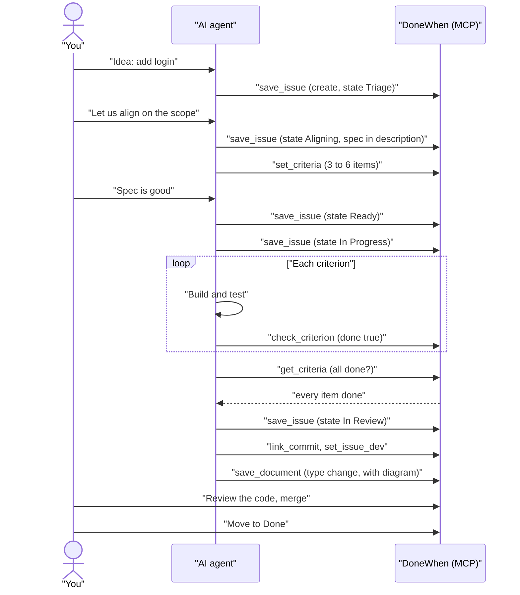

# AI workflow

This page shows how an AI agent drives a ticket in DoneWhen. For the ideas behind it, read [CONCEPTS.md](CONCEPTS.md).

## The loop for one ticket

1. **Capture.** A one-line ticket goes to Triage.
2. **Align.** You and the AI talk. The AI writes the spec into the ticket and sets the done-when checklist (3 to 6 items). The ticket moves to Aligning, then to Ready when the spec is locked.
3. **Build.** The ticket moves to In Progress. The AI works on a branch.
4. **Tick as you go.** The moment an item is met, the AI ticks it. It does not wait for the end. If the session dies, the real progress is already saved.
5. **Review.** All items are done. The AI moves the ticket to In Review. You read the code. If you ask for changes, it goes back to In Progress.
6. **Finish.** The AI saves the commit link, the branch and an engineering document. You merge. The ticket moves to Done.

If the AI cannot finish without you, it moves the ticket to **Blocked** and writes why in a comment.

## How an agent connects

The server has an MCP endpoint at `<your-server>/mcp`. It uses Streamable HTTP and a bearer token (`internal/mcp/mcp.go`). `donewhen mcp` runs the same tools over stdio as a local fallback.

1. Make a token: `donewhen token <name> [workspace]`. Give a workspace to pin the token to it. The token is shown once.
2. Register the server in Claude Code:

```bash
claude mcp add --transport http donewhen \
  https://tracker.example.com/mcp \
  --header "Authorization: Bearer <token>"
```

The tool prefix comes from the name you register the server under. With the name `donewhen`, the tools are `mcp__donewhen__*`. Use another name and the prefix changes with it.

Every call made with a token is recorded with the actor `ai`. Your own browser actions are recorded as `human`.

## The tools, by job

All tools are in `internal/mcp/`. Each one accepts an optional `workspace` argument. Most calls do not need it. A read spans every workspace the token can reach. A write finds the workspace from the issue or epic it names.

| Job | Tools |
|---|---|
| Find and read issues | `list_issues`, `get_issue`, `issue_by_commit` |
| Create, update, move, delete | `save_issue`, `delete_issue` |
| Epics (`project`) and projects (`initiative`) | `list_projects`, `get_project`, `save_project`, `archive_project`, `list_initiatives`, `get_initiative`, `save_initiative` |
| Comments | `list_comments`, `save_comment` |
| States and labels | `list_issue_statuses`, `get_issue_status`, `list_issue_labels`, `create_issue_label` |
| Done-when | `get_criteria`, `set_criteria`, `check_criterion` |
| Record | `link_commit`, `set_issue_dev`, `save_document`, `list_documents`, `get_document`, `get_activity`, `list_issues_missing_docs` |
| Workspaces and people | `list_workspaces`, `save_workspace`, `get_user` |

Example calls, one for each job. The arguments are shown as JSON.

```text
list_issues     {"state": "Ready", "query": "login"}
get_issue       {"id": "ACM-42"}
save_issue      {"id": "ACM-42", "state": "In Progress"}
save_project    {"name": "Billing", "initiative": "<initiative id>"}
save_comment    {"issueId": "ACM-42", "body": "Blocked: need the API key from you."}
list_issue_statuses {}
set_criteria    {"issue": "ACM-42", "items": [{"text": "POST /login returns 200 with a valid password", "done": false}]}
check_criterion {"issue": "ACM-42", "index": 1, "done": true, "evidence": "go test ./internal/auth passes"}
link_commit     {"issue": "ACM-42", "sha": "952917c", "url": "https://github.com/acme/app/commit/952917c"}
set_issue_dev   {"issue": "ACM-42", "gitBranch": "feat/login", "prUrl": "https://github.com/acme/app/pull/7"}
save_document   {"issue": "ACM-42", "type": "change", "title": "Login", "body": "# Login ..."}
list_workspaces {}
```

The argument names above match the tool definitions in `internal/mcp/`.

## The finishing ritual

Do these in order. The order matters. The record is only true if the checklist is true.

1. **Tick every criterion.** `get_criteria` shows each item with `done`. Every item must be `done: true`.
2. **Move the state.** `save_issue` with `state: "In Review"`. After you merge, `Done`.
3. **`link_commit`** for each commit that did the work. Get the SHA from `git rev-parse HEAD`.
4. **`set_issue_dev`** with the branch and the pull request URL.
5. **`save_document`** with type `change`. It says what changed and how, with a Mermaid diagram. Attach it to the issue.

`list_issues_missing_docs` lists Done issues that have no document.

## The done-when gate

The rule: **a ticket does not move to In Review or Done while a criterion is open.**

What happens today:

- The skill tells the agent to run `get_criteria` first and stop if any item is open (`skills/donewhen/SKILL.md`).
- The server does **not** enforce it yet. `save_issue` with `state: "In Review"` succeeds even if items are open. The web app shows the count (for example 3 of 5) on each issue.
- **Planned:** the server will reject the move and say which items are open (ticket PP-203).

So today the gate is kept by the skill and by your review. You always review before Done.

An item that cannot be met is a conversation with you. The agent does not tick it, and does not quietly delete it.

### Criterion kinds

A criterion has a `kind`: `manual`, `deterministic`, `policy` or `judgment` (`internal/models/models.go`). Today the server stores them. Ticking is done by the agent or by you, with an optional `evidence` reference. The server does not run checks itself.

## The Claude Code plugin and skill

Both are optional. DoneWhen works with any MCP client.

**Skill** (`skills/donewhen/`). It teaches Claude how to use the tools well:

- `SKILL.md` has the model, the tool table, the spec-to-tickets steps, the checklist rules and the finishing ritual.
- `TICKETS.md` is the ticket-writing standard: Goal, numbered parts, notes, acceptance tests, out of scope.
- `MERMAID.md` has the rules for diagrams, so they do not show as red error boxes.

**Plugin** (`plugin/`). It adds one command, `/donewhen:tasks`:

- It lists a workspace's open issues, grouped by epic. It can also list workspaces (`workspaces`) and set a default (`use <workspace>`).
- It reads the REST API with a Node script (`plugin/scripts/tasks.mjs`). It has no dependencies. It does not call the model, so it costs no tokens.
- It needs two environment variables: `DONEWHEN_URL` (your server) and `DONEWHEN_TOKEN` (an API token).

## One full ticket



If the agent gets stuck, it sets `Blocked` and adds a comment. You answer. It then returns to In Progress.
