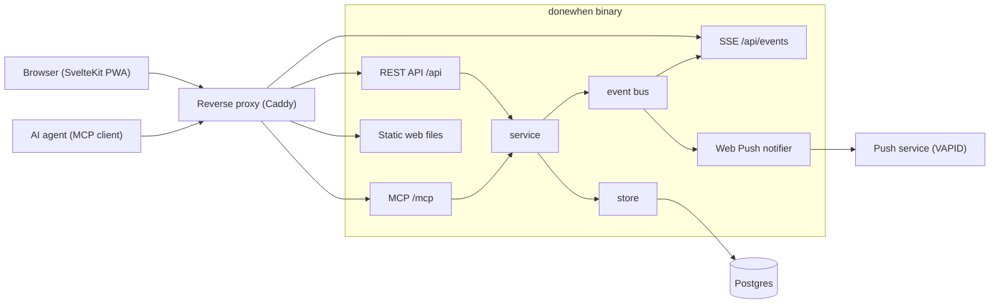
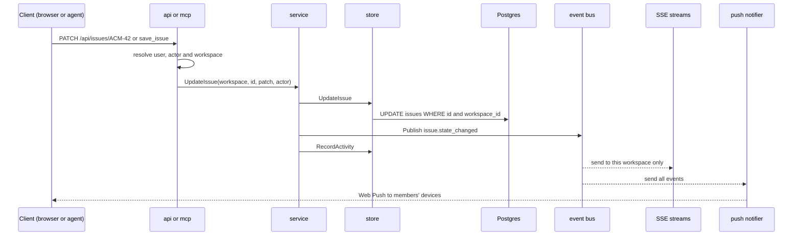

# Architecture

DoneWhen is one Go binary and one Postgres database. You can put a reverse proxy in front of the binary.

## The parts

- The binary serves the REST API, SSE, MCP and the built web files on one port (`internal/api/server.go`).
- The proxy is optional. `Caddyfile` and `compose.yaml` show a proxy. The proxy turns off buffering for `/api/events`.
- Postgres holds all data.
- Web Push is on only when you set both VAPID keys (`DONEWHEN_VAPID_PUBLIC`, `DONEWHEN_VAPID_PRIVATE`).

## Commands

`cmd/donewhen/main.go` is the only entry point. Sub-commands: `serve` (default), `migrate`, `mcp` (MCP over stdio), `token`, `user`, `workspace`, `genvapid`.

The settings come from `DONEWHEN_*` environment variables. `internal/config/config.go` reads them.

## Packages in `internal/`

| Package | What it does |
|---|---|
| `api` | HTTP routes, JSON handlers, CSRF check, workspace guard, and static files with SPA fallback. |
| `auth` | Sessions (cookie, actor `human`), API tokens (bearer, actor `ai`), password hashing, workspace resolution. |
| `config` | Reads the environment variables. Checks the session secret. |
| `db` | Postgres pool and the embedded SQL migration runner. |
| `events` | The in-process event bus, the event types and the workspace filter. |
| `mcp` | The MCP server. It has tools for issues, epics, documents, criteria and commits. It runs over HTTP and stdio. |
| `models` | Plain Go structs that the other packages share. |
| `push` | Makes Web Push messages from events. Sends them to the devices of the members. |
| `service` | Wraps the store. After each change, it publishes an event and writes an activity entry. |
| `sse` | Sends events to the browser as `text/event-stream`. |
| `store` | Holds all SQL. Every method takes a workspace id. |

## Data flow of one change

These are the steps in words:

1. A REST call or an MCP tool call arrives. Both use the same service methods.
2. The service calls the store. The store runs SQL.
3. The service publishes one event on the bus. The types are: `issue.created`, `issue.updated`, `issue.state_changed`, `issue.deleted`, `comment.added`, `document.saved`, `document.deleted` (`internal/events/events.go`).
4. The service also writes an activity entry. This is best-effort. If the write fails, the call does not fail.
5. The bus sends the event to each subscriber. If a buffer is full, the bus drops the event. The bus never blocks.
6. SSE clients get events for their workspace only. The Web Push notifier gets every event. It sends to the members of the workspace of the event.
7. The notifier sends push messages for state changes, new issues and new comments (`internal/push/push.go`).

Because both paths use the service, a change that an agent makes over MCP shows live on your board.

## Multi-tenancy

A **workspace** is the tenant. Everything belongs to one workspace.

- Every root table has a `workspace_id` (`internal/db/migrations/0011_workspaces.sql`).
- Every store method takes a workspace id and puts the id in the SQL, for example `WHERE i.id=$1 AND i.workspace_id=$2` (`internal/store/store.go`).
- The table `workspace_members` holds the membership, with the roles owner, admin and member.
- For REST, `wsGuard` in `internal/api/server.go` finds the workspace and checks the membership before the handler runs. `adminOnly` also needs the owner or admin role.
- The `X-Workspace` header names the workspace. For SSE, `?workspace=` names it (EventSource cannot set headers).
- If you name a workspace that you are not in, the server refuses the request. The server never gives you a different workspace.
- The event bus also filters by workspace (`Subscribe` in `internal/events/events.go`).

### Pinned tokens

You can **pin** an API token to one workspace: `donewhen token <name> <workspace>` (column `api_tokens.workspace_id`, migration `0013_token_workspace.sql`).

- A pinned token can act on that workspace only. A request cannot remove the pin.
- An unpinned token reaches all workspaces of its owner. If there is more than one, a REST call must name one workspace. If it does not, it gets a 400 error.
- For an AI caller, DoneWhen never uses "the workspace you used last". That default is for the browser only (`ResolveWorkspace` in `internal/auth/middleware.go`).
- In MCP, a read spans the workspaces that the token can reach. A write finds its workspace from the issue or epic that it names (`scopeOne` in `internal/mcp/mcp.go`).

Give an agent that works in one repository a token pinned to the workspace of that repository.

## The web app

The web app is in `web/`. It is a SvelteKit single-page app. The static adapter builds it into `web/build`. The Go binary serves those files. For client routes, it serves `index.html`.

- Source: `web/src/routes` (pages), `web/src/components`, `web/src/lib` (API client, SSE client, stores).
- It is a PWA. `web/static/sw.js` and `web/static/manifest.webmanifest` make install and push possible.
- The API client sends the CSRF header and `X-Workspace` (`web/src/lib/api.js`).
- Colours, font sizes and radii are **design tokens**. `web/src/app.css` declares them.
- `npm run check:ds` runs `web/scripts/check-ds.mjs`. It fails on raw colours, raw `px` font sizes and raw `px` border radii outside the token file.
- The check skips a line with `/* ds-ok: <reason> */`.
- `npm run build` runs `check:ds` first. A build with drift fails.
- The browser draws the diagrams in documents with Mermaid.

## Migrations

- The SQL files are in `internal/db/migrations/`. `go:embed` puts them in the binary.
- `db.Migrate` (`internal/db/db.go`) runs at the start of `serve` and `mcp`, and in `donewhen migrate`.
- The files run in name order. The table `schema_migrations` records the files that ran.
- Each file runs in its own transaction. If a file fails, the runner rolls that file back and stops.
- A Postgres advisory lock serialises the runner. Two instances that start together do not race. The second instance waits, then finds no work.

## Deployment

- `Dockerfile` builds the web app, then the Go binary. It copies both into a small Alpine image.
- `compose.yaml` runs Postgres, the app, and an optional Caddy proxy.
- The README and [SELF-HOSTING.md](SELF-HOSTING.md) have the hosting steps.
