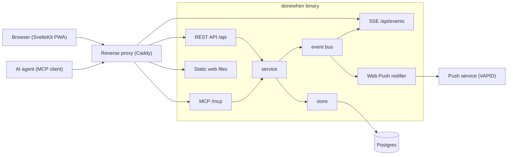
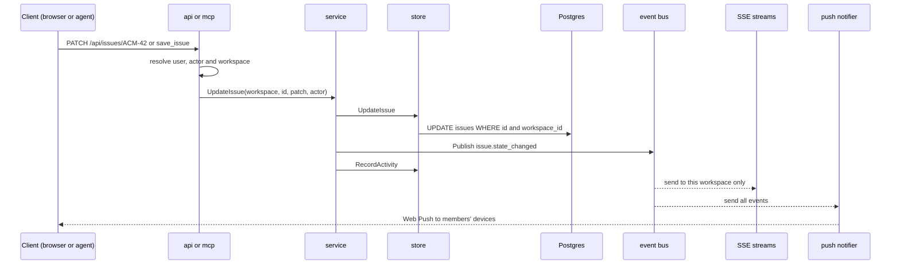

# Architecture

DoneWhen is one Go binary and one Postgres database. A reverse proxy can sit in front.

## The parts

- The binary serves the REST API, SSE, MCP and the built web files on one port (`internal/api/server.go`).
- The proxy is optional. `Caddyfile` and `compose.yaml` show one. It turns off buffering for `/api/events`.
- Postgres holds all data.
- Web Push is on only when both VAPID keys are set (`DONEWHEN_VAPID_PUBLIC`, `DONEWHEN_VAPID_PRIVATE`).

## Commands

`cmd/donewhen/main.go` is the single entry point. Sub-commands: `serve` (default), `migrate`, `mcp` (MCP over stdio), `token`, `user`, `workspace`, `genvapid`.

Settings come from `DONEWHEN_*` environment variables, read in `internal/config/config.go`. The old `RAENIL_*` names still work for one release.

## Packages in `internal/`

| Package | What it does |
|---|---|
| `api` | HTTP routes, JSON handlers, CSRF check, workspace guard, static files with SPA fallback. |
| `auth` | Sessions (cookie, actor `human`), API tokens (bearer, actor `ai`), password hashing, workspace resolution. |
| `config` | Reads environment variables. Checks the session secret. |
| `db` | Postgres pool and the embedded SQL migration runner. |
| `events` | The in-process event bus. Event types and the workspace filter. |
| `mcp` | The MCP server: tools for issues, epics, documents, criteria and commits. Runs over HTTP and stdio. |
| `models` | Plain Go structs shared by the other packages. |
| `push` | Builds Web Push messages from events and sends them to members' devices. |
| `service` | Wraps the store. After each change it publishes an event and writes an activity entry. |
| `sse` | Streams events to the browser as `text/event-stream`. |
| `store` | All SQL. Every method takes a workspace id. |

## Data flow of one change

Steps in words:

1. A REST call or an MCP tool call arrives. Both use the same service methods.
2. The service calls the store. The store runs SQL.
3. The service publishes one event on the bus. Types: `issue.created`, `issue.updated`, `issue.state_changed`, `issue.deleted`, `comment.added`, `document.saved`, `document.deleted` (`internal/events/events.go`).
4. The service also writes an activity entry. This is best-effort. A failure does not fail the call.
5. The bus sends the event to each subscriber. A full buffer drops the event. The bus never blocks.
6. SSE clients get events for their workspace only. The Web Push notifier gets every event and sends to the members of the event's workspace.
7. Push messages are sent for state changes, new issues and new comments (`internal/push/push.go`).

Because both paths use the service, a change made by an agent over MCP shows up live on your board.

## Multi-tenancy

A **workspace** is the tenant. Everything belongs to one.

- Every root table has a `workspace_id` (`internal/db/migrations/0011_workspaces.sql`).
- Every store method takes a workspace id and puts it in the SQL, for example `WHERE i.id=$1 AND i.workspace_id=$2` (`internal/store/store.go`).
- Membership is in `workspace_members`, with the roles owner, admin and member.
- For REST, `wsGuard` in `internal/api/server.go` finds the workspace and checks membership before the handler runs. `adminOnly` also needs the owner or admin role.
- The workspace is named by the `X-Workspace` header, or by `?workspace=` for SSE (EventSource cannot set headers).
- If you name a workspace you are not in, the request is refused. You are never given a different one.
- The event bus filters by workspace too (`Subscribe` in `internal/events/events.go`).

### Pinned tokens

An API token can be **pinned** to one workspace: `donewhen token <name> <workspace>` (column `api_tokens.workspace_id`, migration `0013_token_workspace.sql`).

- A pinned token can act on that workspace only. It cannot be talked out of the pin.
- An unpinned token spans all of its owner's workspaces. If there is more than one, a REST call must name one, or it gets a 400 error.
- For an AI caller, DoneWhen never falls back to "the workspace you used last". That default is for the browser only (`ResolveWorkspace` in `internal/auth/middleware.go`).
- In MCP, reads span the reachable workspaces. A write finds its workspace from the issue or epic it names (`scopeOne` in `internal/mcp/mcp.go`).

Give an agent that works in one repository a token pinned to that repository's workspace.

## The web app

The web app is in `web/`. It is a SvelteKit single-page app, built with the static adapter into `web/build`. The Go binary serves those files and falls back to `index.html` for client routes.

- Source: `web/src/routes` (pages), `web/src/components`, `web/src/lib` (API client, SSE client, stores).
- It is a PWA. `web/static/sw.js` and `web/static/manifest.webmanifest` support install and push.
- The API client sends the CSRF header and `X-Workspace` (`web/src/lib/api.js`).
- Colours, font sizes and radii are **design tokens**, declared in `web/src/app.css`.
- `npm run check:ds` runs `web/scripts/check-ds.mjs`. It fails on raw colours, raw `px` font sizes and raw `px` border radii outside the token file.
- A line with `/* ds-ok: <reason> */` is exempt.
- `npm run build` runs `check:ds` first. A build with drift fails.
- Diagrams in documents are drawn with Mermaid in the browser.

## Migrations

- SQL files live in `internal/db/migrations/` and are embedded in the binary with `go:embed`.
- `db.Migrate` (`internal/db/db.go`) runs at the start of `serve` and `mcp`, and in `donewhen migrate`.
- Files run in name order. The table `schema_migrations` records the ones applied.
- Each file runs in its own transaction. A failure rolls that file back and stops.
- **Planned:** a Postgres advisory lock, so two instances starting together do not race (ticket PP-200). Today there is no lock. Run one instance, or run `donewhen migrate` first.

## Deployment

- `Dockerfile` builds the web app, then the Go binary, and copies both into a small Alpine image.
- `compose.yaml` runs Postgres, the app, and an optional Caddy proxy.
- Hosting steps are in the README and in `docs/DEPLOY.md`.
